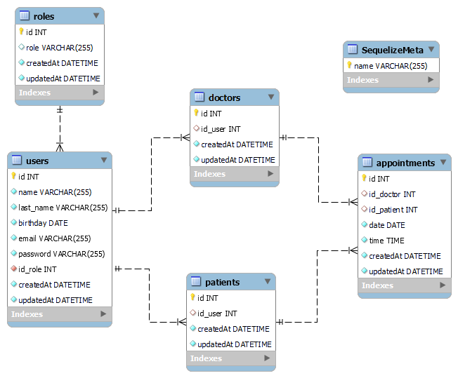

# Backend para una Clinica Dental

<details>
  <summary>Contenido 📝</summary>
  <ol>
    <li><a href="#objetivo">Objetivo</a></li>
    <li><a href="#sobre-el-proyecto">Sobre el proyecto</a></li>
    <li><a href="#deploy-🚀">Deploy</a></li>
    <li><a href="#stack">Stack</a></li>
    <li><a href="#diagrama-bd">Diagrama</a></li>
    <li><a href="#instalación-en-local">Instalación</a></li>
    <li><a href="#endpoints">Endpoints</a></li>
    <li><a href="#futuras-funcionalidades">Futuras funcionalidades</a></li>
    <li><a href="#contribuciones">Contribuciones</a></li>
    <li><a href="#contacto">Contacto</a></li>
  </ol>
</details>

## Objetivo

Este proyecto requería una API funcional conectada a una base de datos con al menos una relación de uno a muchos y una relación de muchos a muchos.

## Sobre el proyecto

Aplicación API de ejemplo para la gestión de una base de datos de una Clinica Dental. La gestión se realiza teniendo en cuenta los distintos tipos de roles (admin, user, doctor) y la autenticación basada en token.

## Deploy 🚀

<div align="center">
    🚀<a href="https://www.google.com"><strong>Url a producción </strong></a>🚀
</div>

## Stack

Tecnologías utilizadas:

<div align="center">
<a href="https://sequelize.org/">
    
</a>
<a href="https://www.expressjs.com/">
    
</a>
<a href="https://nodejs.org/es/">
    
</a>
<a href="https://developer.mozilla.org/es/docs/Web/JavaScript">
    
</a>
 </div>

## Diagrama BD



## Instalación en local

1. Clonar el repositorio
2. `$ npm install`
3. Conectamos nuestro repositorio con la base de datos
4. `$ Ejecutamos las migraciones`
5. `$ Ejecutamos los seeders`
6. `$ npm run dev`

## Endpoints

<details>
<summary>Endpoints</summary>

- AUTH

  - Registrar

          POST http://localhost:3000/auth/register

    body:

    ```js
        {
            "name" : "Bob",
            "last_name": "Cooper",
            "email": "bob@cooper.com",
            "birthday": "2002-02-02",
            "password": "12345678",
        }
    ```

  - Login

          POST http://localhost:3000/auth/login

    body:

    ```js
        {
            "email": "bob@cooper.com",
            "password": "12345678"
        }
    ```

- ADMIN

  - Obtener todos los usuarios

          GET http://localhost:3000/admin/users

  - Obtener paciente por id

          GET http://localhost:3000/api/users/:id

  - Obtener perfil de paciente

          GET http://localhost:3000/api/users/profile

  - Actualizar perfil de paciente

          PUT http://localhost:3000/api/users/update

    body:

    ```js
        {
            "last_name": "Brown",
            "birthday": "2000-01-01",
            "password": "12345678"
        }
    ```

  </details>

## Futuras funcionalidades

[ ] Añadir mas end-points para la gestión de usuarios  
[ ] Añadir end-points para la gestión de citas

</p>
