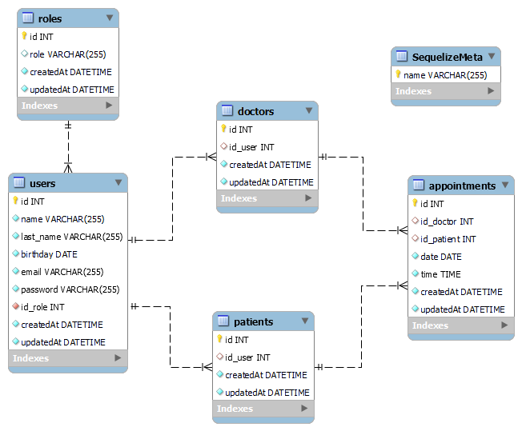

# Backend para una Clinica Dental

<details>
  <summary>Contenido 📝</summary>
  <ol>
    <li><a href="#objetivo">Objetivo</a></li>
    <li><a href="#sobre-el-proyecto">Sobre el proyecto</a></li>
    <li><a href="#deploy-🚀">Deploy</a></li>
    <li><a href="#stack">Stack</a></li>
    <li><a href="#diagrama-bd">Diagrama</a></li>
    <li><a href="#instalación-en-local">Instalación</a></li>
    <li><a href="#endpoints">Endpoints</a></li>
    <li><a href="#futuras-funcionalidades">Futuras funcionalidades</a></li>
    <li><a href="#contribuciones">Contribuciones</a></li>
    <li><a href="#contacto">Contacto</a></li>
  </ol>
</details>

## Objetivo

Este proyecto requería una API funcional conectada a una base de datos con al menos una relación de uno a muchos y una relación de muchos a muchos.

## Sobre el proyecto

Aplicación API de ejemplo para la gestión de una base de datos de una Clinica Dental. La gestión se realiza teniendo en cuenta los distintos tipos de roles (admin, user, doctor) y la autenticación basada en token.

## Deploy 🚀

<div align="center">
    🚀<a href="https://www.google.com"><strong>Url a producción </strong></a>🚀
</div>

## Stack

Tecnologías utilizadas:

<div align="center">
<a href="https://sequelize.org/">
    
</a>
<a href="https://www.expressjs.com/">
    
</a>
<a href="https://nodejs.org/es/">
    
</a>
<a href="https://developer.mozilla.org/es/docs/Web/JavaScript">
    
</a>
 </div>

## Diagrama BD



## Instalación en local

1. Clonar el repositorio
2. `$ npm install`
3. Conectamos nuestro repositorio con la base de datos
4. `$ Ejecutamos las migraciones`
5. `$ Ejecutamos los seeders`
6. `$ npm run dev`

## Endpoints

<details>
<summary>Endpoints</summary>

- AUTH

  - Registrar 

          POST http://localhost:3000/auth/register/alumno

    body:

    ```js
        {
            "nombre" : "Bob",
            "apellidos": "Cooper",
            "email": "bob@cooper.com",
            "password": "12345678",
            "fecha_nacimiento": "2002-02-02",
            "activo": "si",
            "id_nacionalidad": 1,
            "id_direccion": 2
        }
    ```

  - Login

          POST http://localhost:3000/auth/login

    body:

    ```js
        {
            "email": "bob@cooper.com",
            "password": "12345678"
        }
    ```

- ALUMNOS

  - Obtener todos los alumnos

          GET http://localhost:3000/api/alumnos?page=1

  - Obtener alumno por id

          GET http://localhost:3000/api/alumnos/:id

  - Obtener alumnos por nombre

          GET http://localhost:3000/api/alumnos/nombre/:name

  - Obtener perfil de alumno

          GET http://localhost:3000/api/alumnos/profile

  - Actualizar perfil de alumno

          PUT http://localhost:3000/api/alumnos/profile

    body:

    ```js
        {
            "apellidos": "Brown",
            "fecha_nacimiento": "2000-01-01",
            "password": "123456789"
        }
    ```

- USUARIOS - Obtener todos los usuarios (incluye alumnos)

              GET http://localhost:3000/api/users?page=1

  </details>

## Futuras funcionalidades

[ ] Añadir mas end-points para la gestión de usuarios (incluye alumnos)  
[ ] Añadir end-points para la gestión de cursos  
[ ] Añadir logs con winston  
[ ] Validaciones de la solicitud con express-validator

## Contribuciones

Las sugerencias y aportaciones son siempre bienvenidas.

Puedes hacerlo de dos maneras:

1. Abriendo una issue
2. Crea un fork del repositorio
   - Crea una nueva rama
     ```
     $ git checkout -b feature/nombreUsuario-mejora
     ```
   - Haz un commit con tus cambios
     ```
     $ git commit -m 'feat: mejora X cosa'
     ```
   - Haz push a la rama
     ```
     $ git push origin feature/nombreUsuario-mejora
     ```
   - Abre una solicitud de Pull Request

## Contacto

<a href="https://www.linkedin.com/in/fidel-gilart-gilart/" target="_blank"></a>

</p>
